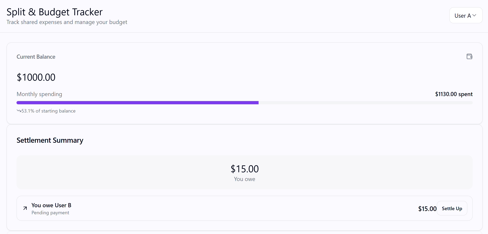
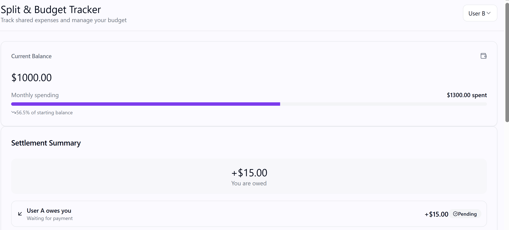
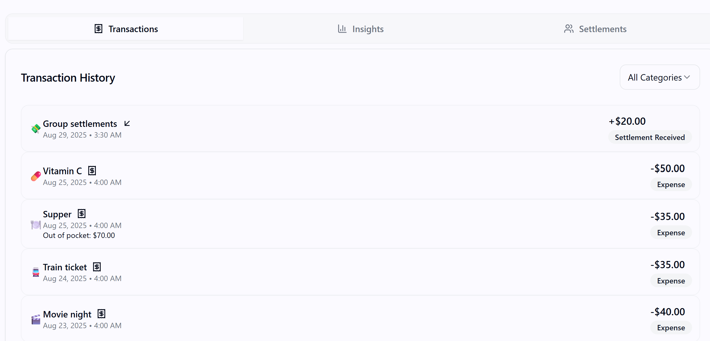
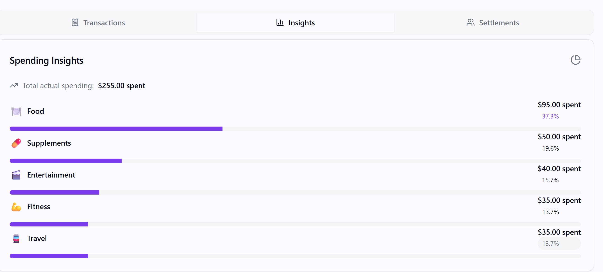
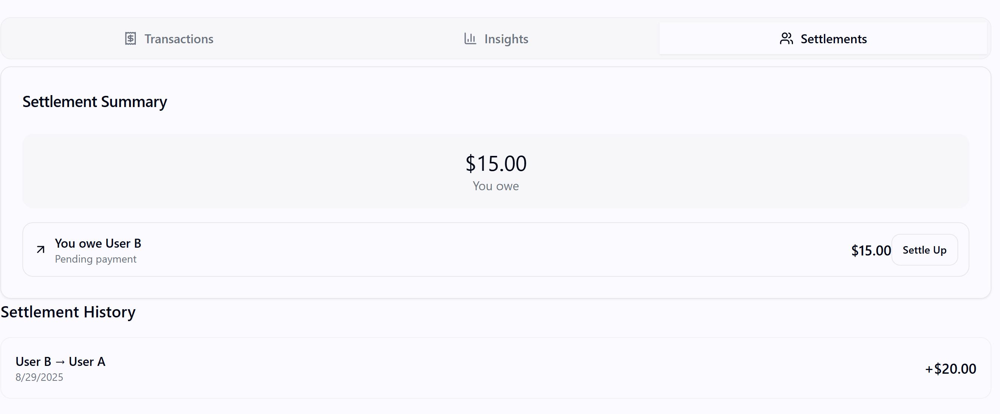

# Mate-Money-Mind: Split & Budget Tracker

A modern, responsive web application that helps friends track shared expenses and manage budgets effectively. Built with React, Vite, and Tailwind CSS.

## How to Run the App

### Prerequisites

- Node.js (v18 or higher)
- npm or yarn package manager

### Installation & Setup

1. **Clone the repository**

   ```bash
   git clone <your-repo-url>
   cd Mate-Money-Mind
   ```

2. **Install dependencies**

   ```bash
   npm install
   ```

3. **Start the development server**

   ```bash
   npm run dev
   ```

4. **Open your browser**
   Navigate to `http://localhost:8080` (or the port shown in your terminal)

## Example Screenshots

#### User Dashboards
  
This shows **User A’s dashboard**, with the current balance at the top, a monthly spending bar, and a settlement summary. The goal here is to give users a **quick snapshot** of their financial position. The design is intentionally clean and minimal, so the most important data, balance, spending, and settlements stand out immediately.  

  
This is **User B’s dashboard**, which mirrors User A’s but from the opposite settlement perspective. When **User A clicks "Settle Up"**, User B is automatically informed that the payment has been settled, ensuring **synchronization and transparency**. In the **top-right corner**, developers can toggle between account perspectives. This is included for development and demonstration purposes only, to preview how the interface looks from the other user’s point of view.

---

#### Transactions
  
The **Transaction History** provides a chronological list of all group settlements and expenses, complete with categories, amounts, and timestamps. This design makes it easy to **verify past activity** and maintain accountability.  
Users can also **filter transactions by category** (e.g., Food, Fitness, Entertainment), which makes reviewing spending more personalized and efficient. The use of icons next to categories improves **visual recognition** and reduces cognitive load.  

---

#### Insights
  
The **Spending Insights** page breaks down expenses by category with both percentages and progress bars. This dual representation allows users to **understand not just amounts but proportions** of their spending. For example, food might take up 37.3% of total spending, while fitness and travel are much smaller shares.  
This UI choice helps users **identify patterns and areas of overspending**, encouraging better budgeting habits.  

---

#### Settlements
  
The **Settlements** screen provides a clear summary of pending balances between users along with a detailed settlement history. The design emphasizes **clarity and accountability**, removing confusion about who owes whom and how much. The prominent "Settle Up" button ensures that users can **quickly resolve balances** with a single click, while the history log maintains a permanent record of past transactions for trust and transparency.  

---

### Design Rationale
The UI was built with a focus on **simplicity, clarity, and fairness**:
- **Simplicity:** Minimalist layouts with clear sections prevent users from feeling overwhelmed.  
- **Clarity:** Progress bars, percentages, and filters provide multiple ways to understand spending quickly.  
- **Usability:** Features like filtering transactions, toggling user perspectives, and synchronized "Settle Up" actions were added to make the experience **intuitive and trustworthy**.  
- **Visual Guidance:** Icons and progress indicators reduce the need for reading dense text and make financial data **easier to digest at a glance**.  


## Design Decisions

### 1. **Component Architecture**

- **Modular Design**: Each major feature is a separate, reusable component
- **Single Responsibility**: Components focus on one specific functionality
- **Props-based Communication**: Clean data flow between parent and child components

### 2. **UI/UX Philosophy**

- **Clarity First**: Information hierarchy designed for quick understanding
- **Progressive Disclosure**: Show essential info first, details on demand
- **Visual Consistency**: Unified color scheme, spacing, and typography
- **Responsive Design**: Mobile-first approach with desktop enhancements

### 3. **Data Visualization Strategy**

- **Tab-based Navigation**: Logical grouping of related information
- **Card-based Layout**: Easy scanning and comparison of data
- **Color Coding**: Intuitive use of colors (green for income, red for expenses)
- **Progress Indicators**: Visual representation of spending vs. budget

### 4. **User Experience Considerations**

- **User Selector**: Easy switching between different user perspectives
- **Real-time Updates**: Immediate feedback on settlement actions
- **Filtering & Sorting**: Quick access to relevant transaction data
- **Toast Notifications**: Clear feedback for user actions

### 5. **Technical Implementation Choices**

- **React Hooks**: Modern state management with useState and useEffect
- **Tailwind CSS**: Rapid development with consistent design system
- **Component Libraries**: shadcn/ui for polished, accessible components
- **Mock Data Structure**: Flexible data model for future backend integration

## Features Considered But Not Implemented

### 1. **Advanced Analytics**

- **Monthly/Yearly Trends**: Historical spending patterns over time
- **Budget Alerts**: Notifications when approaching spending limits
- **Category Budgets**: Individual budget limits per expense category
- **Spending Predictions**: AI-powered future expense forecasting

### 2. **Enhanced User Management**

- **User Profiles**: Detailed user information and preferences
- **Group Management**: Support for more than two users
- **User Permissions**: Different access levels and roles
- **User Avatars**: Visual identification and personalization

### 3. **Financial Features**

- **Currency Support**: Multi-currency expense tracking
- **Receipt Upload**: Photo/document storage for transactions
- **Recurring Expenses**: Automatic transaction creation
- **Export Functionality**: PDF/CSV reports for accounting

### 4. **Social Features**

- **Expense Sharing**: Social media integration for expense sharing
- **Comments & Notes**: Discussion threads on shared expenses
- **Expense Challenges**: Gamification elements for budget goals
- **Group Chat**: Built-in communication for expense coordination


## Technical Architecture

### Frontend Stack

- **Framework**: Reactjs with modern hooks
- **Build Tool**: Vite for fast development and building
- **Styling**: Tailwind CSS with custom design system
- **UI Components**: shadcn/ui component library
- **State Management**: React hooks for local state
- **Routing**: React Router for navigation

### Project Structure

```
src/
├── components/          # Reusable UI components
├── pages/              # Main page components
├── data/               # Mock data and data models
├── hooks/              # Custom React hooks
├── lib/                # Utility functions
└── ui/                 # shadcn/ui components
```

### Key Components

- **BalanceCard**: Current balance and spending overview
- **SettlementCard**: Settlement summary and management
- **TransactionList**: Transaction history with filtering
- **SpendingInsights**: Category-based spending analysis
- **UserSelector**: User switching functionality

## Problem-Solving Approach

### 1. **Core Problem Analysis**

- **Payables & Receivables**: Clear visualization of who owes whom
- **True Spending vs. Advance Payments**: Distinction for accurate budgeting
- **Multiple Transaction Handling**: Complex expense scenarios

### 2. **Solution Design**

- **Net Balance Calculation**: Automatic computation of overall position
- **Category-based Analysis**: Understanding spending patterns
- **Settlement Simulation**: UI-based settlement management
- **Real-time Updates**: Immediate state changes for user feedback

### 3. **User Experience Focus**

- **Information Hierarchy**: Most important data prominently displayed
- **Actionable Insights**: Clear next steps for users
- **Error Prevention**: Validation and confirmation for critical actions
- **Accessibility**: Screen reader support and keyboard navigation

**Built with using React, Vite, and Tailwind CSS**
